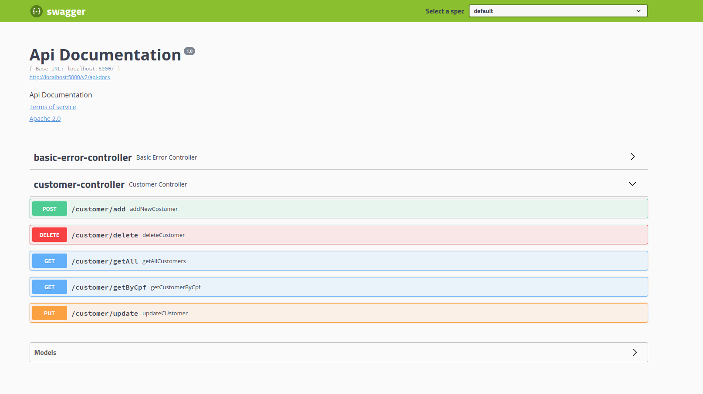

# Marvel Api

Este projeto tem a missão de re-implementar os endpoints characters da API perdida da Marvel

- [Recursos](#recursos)
  - [Documentação APIs](#documentação-apis)
- [Desenvolvimento](#desenvolvimento)
  - [Requisitos](#requisitos)
  - [Instalação](#instalação)
    - [Docker](#docker-compose)
  - [Configuração](#configuração)
  - [Testes](#Testes)
  
### Documentação APIs

Para a documentação é utilizado o [Swagger](https://swagger.io/). Ferramenta que provê interface para testes.



Por padrão a documentação está disponível no endpoint `/v2/api-docs`.

### Catálogo de erros

| Erro | Descrição           | Ocorre quando                                                  |
| ---- | ------------------- | -------------------------------------------------------------- |
|  400 | Bad Request         | Os dados enviados no request estão inválidos                   |
|  404 | Not Found           | O recurso não foi encontrado                                   |
|  500 | Internal Error      | Acontece um erro interno no módulo                             |

## Desenvolvimento

### Requisitos

```

* Maven
* Docker
* Docker Compose
* Mysql

```

### Instalação

#### Docker compose:

Acessar a pasta raiz do projeto e executar:

```

https://docs.docker.com/compose/install/
docker-compose up -d

```

### Configuração

Lista de variáveis de ambiente necessárias para a execução da aplicação

| Variável               | Descrição                             |   Tipo   | Obrigatório |  Valor Padrão   |
| ---------------------- | ------------------------------------- | :------: | :---------: | :-------------: |
| DATABASE_NAME          | Nome do banco de dados                |  Texto   |     Não     |    marvel-api    |
| DATABASE_USERNAME      | Usuário para conexão de dados         |  Texto   |     Não     |    marvel-api    |
| DATABASE_PASSWORD      | Senha do usuário para acesso ao banco |  Texto   |     Não     |    marvel-api    |
| DATABASE_HOST          | Host para acesso ao Banco             |  Texto   |     Não     |    localhost    |
| DATABASE_PORT          | Porta para acesso ao Banco            | Numérico |     Não     |      3306       |


### Testes

```bash
# unit tests
$ mvn package

```
> A pasta para verificar o coverage do projeto se encontra na pasta raiz do projeto > target/site/jacoco/index.html.
>Também é possivel verificar pela badge do [gitlab do projeto](https://gitlab.com/vinicius.csantos/marvel-api)

### Outros

Os nomes e descrição dos personagens foram gerados nos sites [Dungeon Revolution](http://dungeonevolution.orgfree.com/helprpg/#) e [Plarium](https://plarium.com/pt/resource/generator/superhero-name-generator/)
